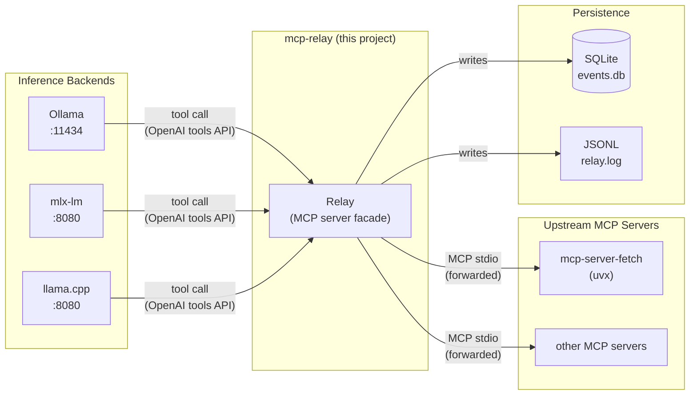
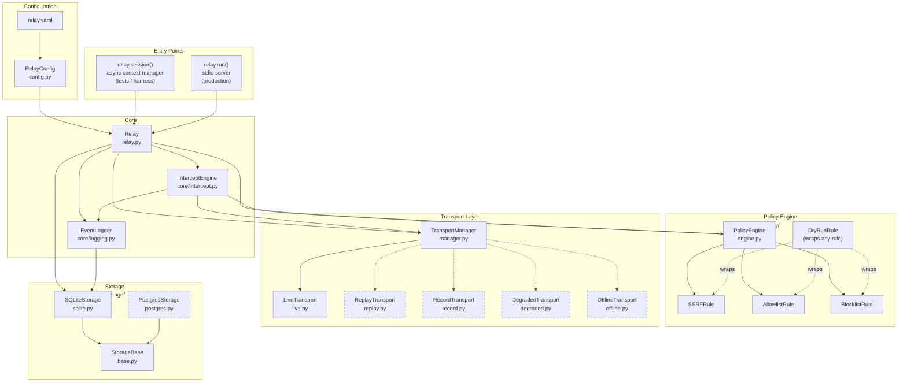
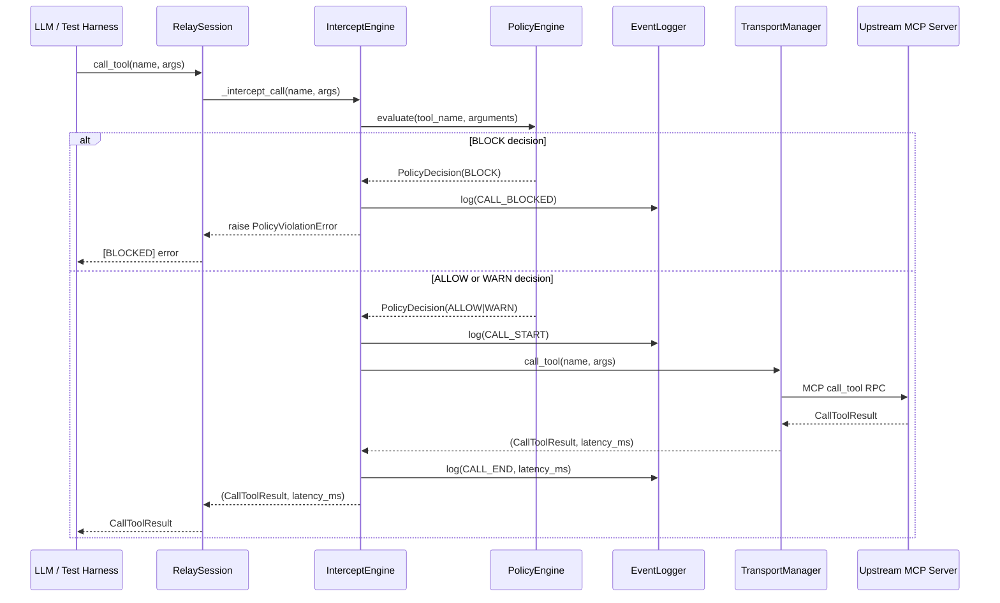
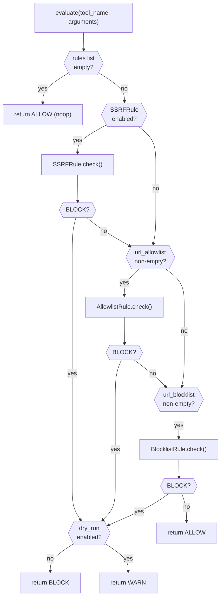
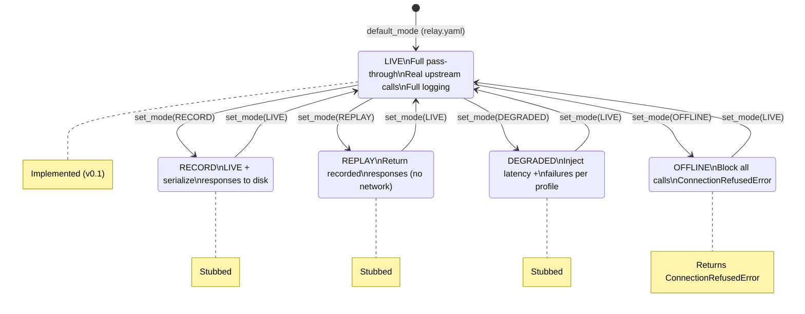
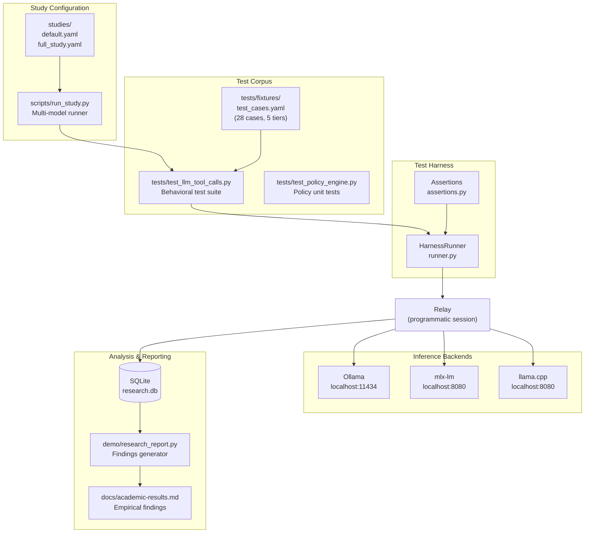
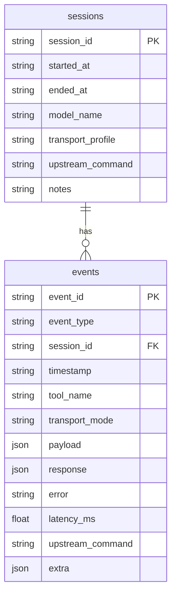
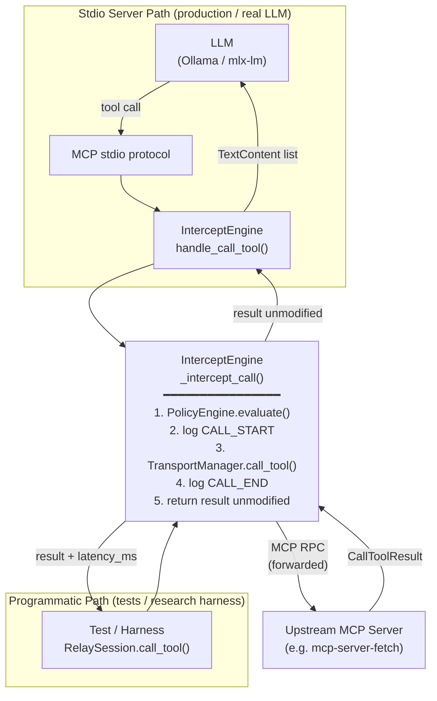
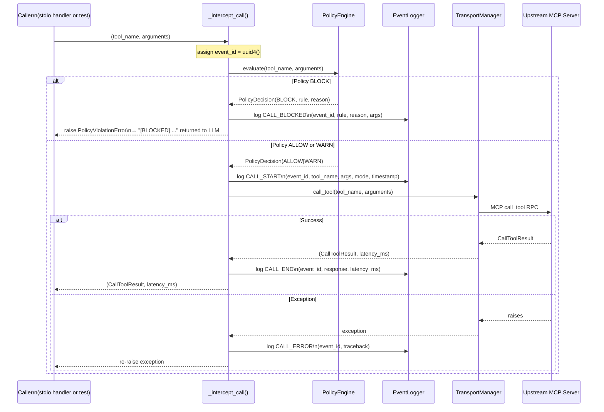
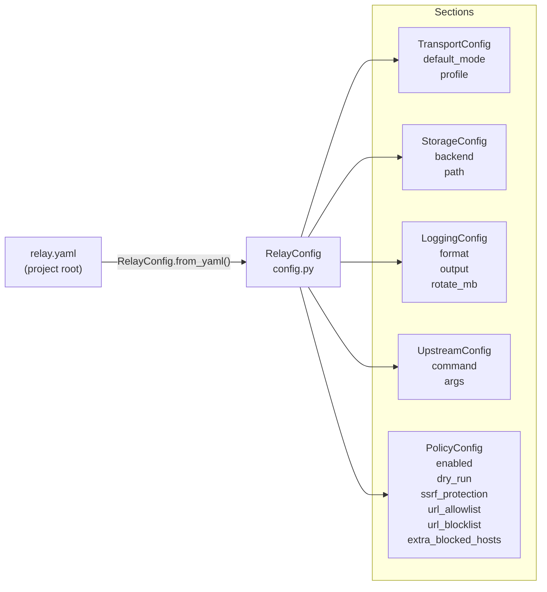

# mcp-relay: Architectural Design

## 1. System Context

mcp-relay is a transparent MCP proxy that sits between an LLM inference backend and an upstream MCP server. The LLM is unaware of the relay's presence.

---

## 2. Internal Component Architecture

> Dashed borders = partially implemented / stubbed in v0.1.

---

## 3. Tool Call Sequence

Every tool call — whether from the research harness or a live LLM — follows this path through the relay.

---

## 4. Policy Engine Decision Flow

---

## 5. Transport Mode State Machine

---

## 6. Research Harness Architecture

The research layer orchestrates multi-model behavioral studies through the relay.

---

## 7. Storage Schema

**Event types:** `call_start`, `call_end`, `call_error`, `call_blocked`, `mode_change`

---

## 8. Interception Mechanism

### How the relay intercepts calls without the LLM's awareness

The relay does not sit in front of the upstream server at the network level. Instead, `InterceptEngine` **impersonates** the MCP server entirely: it creates its own `mcp.server.Server` instance, registers `list_tools` and `call_tool` handlers on it, and mirrors the upstream tool schemas exactly. The LLM communicates with this facade over stdio and has no visibility into the real upstream behind it.

### Two entry paths, one core pipeline

### The tool schema mirror trick

On startup, `InterceptEngine.__init__` fetches the upstream's tool list and re-registers those identical schemas on its own `mcp.server.Server`. The LLM's `list_tools` request returns the real upstream definitions — so from the model's perspective it is talking directly to `mcp-server-fetch`.

### The `_intercept_call()` pipeline in detail

### Event identity and lifecycle reconstruction

Every call is assigned a single `event_id` (UUID) at the start of `_intercept_call()`. All events emitted for that call — `CALL_START`, `CALL_END`, `CALL_BLOCKED`, and `CALL_ERROR` — share this ID. Querying `WHERE event_id = ?` in the SQLite DB reconstructs the full lifecycle of any individual call, including latency and whether it was blocked before reaching the upstream.

### What the relay never does

- It never modifies arguments before forwarding them to the upstream.
- It never modifies responses before returning them to the LLM.
- A blocked call never reaches the upstream — it is terminated inside `_intercept_call()` before `TransportManager` is invoked.

---

## 9. Configuration Hierarchy

